# Scoring single-cell data with PhenoMapR

## Overview

This vignette demonstrates how to use **`PhenoMapR`** on a single-cell
RNA-seq dataset. We use the **CRA001160** pancreatic cancer dataset from
[Peng et al. 2019](https://doi.org/10.1038/s41422-019-0195-y)
[\[1\]](#ref1). This dataset comprises single-cell RNA-seq of 57,530
pancreatic cells from 25 primary PAAD tumors and 9 control pancreases.
Pre-processed expression and metadata were obtained from
[TISCH2](https://tisch.compbio.cn/home/) [\[2\]](#ref2). We score all
samples in the dataset with **TCGA** and **PRECOG** meta-z signatures
[\[3\]](#ref3) then use the metadata and score outputs to visualize cell
types of interest, define prognostic groups of cells, and identify
marker genes for the most phenotype associated cell populations. Results
are compared with those obtained using the **SIDISH** method from
[Jolasun et
al. 2025](https://www.nature.com/articles/s41467-025-66162-4)
[\[4\]](#ref4).

## Load data

We will use pre-processed expression and annotation files from TISCH2
for the CRA001160 dataset. Download the expression matrix and cell
metadata from Google Drive and visualize cell type distributions across
all samples in the dataset.

``` r

suppressPackageStartupMessages({
  if (!isTRUE(.try_load_phenomapr_dev())) {
    library(PhenoMapR)
  }
  library(googledrive)
  library(ggplot2)
  library(ggpubr)
  library(dplyr)
  library(tidyr)
  library(Seurat)
  library(patchwork)
  library(ComplexHeatmap)
  library(circlize)
  library(ggchicklet2)
})

options(googledrive_quiet = TRUE)
googledrive::drive_deauth()

# Full CRA001160 only (no packaged subset). Prefer local full bundle /
# H5+TSV / Seurat, then CI URL secrets, then Google Drive.
.h5_name <- "PAAD_CRA001160_expression.h5"
.meta_name <- "PAAD_CRA001160_CellMetainfo_table.tsv"
.seurat_name <- "PAAD_CRA001160_seurat.rds"
.full_name <- "PAAD_CRA001160_full.rds"

.find_vignette_data <- function(filename) {
  candidates <- c(
    filename,
    file.path("vignettes", filename),
    file.path("..", filename),
    file.path("..", "vignettes", filename)
  )
  hit <- candidates[file.exists(candidates)][1]
  if (is.na(hit)) NULL else hit
}
.is_drive_quota_json <- function(path) {
  info <- file.info(path)
  if (is.null(path) || !isTRUE(file.exists(path)) ||
      is.na(info$size) || info$size < 10 || info$size > 5000) {
    return(FALSE)
  }
  txt <- tryCatch(
    paste(readLines(path, n = 30L, warn = FALSE), collapse = "\n"),
    error = function(e) ""
  )
  grepl("downloadQuotaExceeded|The download quota for this file", txt)
}
.purge_quota_stub <- function(path) {
  if (.is_drive_quota_json(path)) {
    message("Removing Google Drive quota error stub: ", path)
    unlink(path)
  }
}
.is_valid_h5 <- function(path) {
  if (is.null(path) || !isTRUE(file.exists(path))) return(FALSE)
  .purge_quota_stub(path)
  if (!isTRUE(file.exists(path))) return(FALSE)
  info <- file.info(path)
  if (is.na(info$size) || info$size < 1e6) return(FALSE)
  con <- file(path, "rb")
  on.exit(close(con), add = TRUE)
  magic <- readBin(con, what = "raw", n = 8L)
  identical(magic, as.raw(c(0x89, 0x48, 0x44, 0x46, 0x0d, 0x0a, 0x1a, 0x0a)))
}
.is_valid_meta_tsv <- function(path) {
  if (is.null(path) || !isTRUE(file.exists(path))) return(FALSE)
  .purge_quota_stub(path)
  if (!isTRUE(file.exists(path))) return(FALSE)
  info <- file.info(path)
  if (is.na(info$size) || info$size < 1e5) return(FALSE)
  hdr <- tryCatch(readLines(path, n = 1L, warn = FALSE), error = function(e) "")
  grepl("UMAP_1", hdr, fixed = TRUE) && grepl("Cell", hdr, fixed = TRUE)
}
.is_valid_rds_blob <- function(path) {
  if (is.null(path) || !isTRUE(file.exists(path))) return(FALSE)
  .purge_quota_stub(path)
  if (!isTRUE(file.exists(path))) return(FALSE)
  info <- file.info(path)
  if (is.na(info$size) || info$size < 1e5) return(FALSE)
  con <- file(path, "rb")
  on.exit(close(con), add = TRUE)
  magic <- readBin(con, what = "raw", n = 6L)
  is_gzip <- length(magic) >= 2L && identical(magic[1:2], as.raw(c(0x1f, 0x8b)))
  is_xz <- length(magic) >= 6L && identical(
    magic[1:6], as.raw(c(0xfd, 0x37, 0x7a, 0x58, 0x5a, 0x00))
  )
  is_rds <- length(magic) >= 2L && identical(rawToChar(magic[1:2]), "RD")
  is_gzip || is_xz || is_rds
}
.resolve_vignette_file <- function(filename, drive_id, env_var, validator,
                                   try_drive = TRUE) {
  existing <- .find_vignette_data(filename)
  if (!is.null(existing) && isTRUE(validator(existing))) return(existing)
  dest <- filename
  url <- Sys.getenv(env_var, unset = "")
  if (nzchar(url)) {
    message("Downloading ", filename, " from ", env_var)
    ok <- tryCatch({
      utils::download.file(url, dest, mode = "wb", quiet = TRUE)
      TRUE
    }, error = function(e) {
      message("URL download failed: ", conditionMessage(e))
      FALSE
    })
    if (isTRUE(ok) && isTRUE(validator(dest))) return(dest)
    if (file.exists(dest)) unlink(dest)
  }
  if (isTRUE(try_drive) && !is.null(drive_id) && nzchar(drive_id)) {
    message("Downloading ", filename, " from Google Drive")
    ok <- tryCatch({
      googledrive::drive_download(
        googledrive::as_id(drive_id), dest, overwrite = TRUE
      )
      TRUE
    }, error = function(e) {
      message("Google Drive download failed: ", conditionMessage(e))
      FALSE
    })
    if (isTRUE(ok) && isTRUE(validator(dest))) return(dest)
    .purge_quota_stub(dest)
    if (file.exists(dest) && !isTRUE(validator(dest))) unlink(dest)
  }
  NULL
}
.normalize_cra_meta <- function(meta_df) {
  if ("Celltype (original)" %in% names(meta_df)) {
    meta_df <- meta_df %>%
      mutate(`Celltype (original)` = gsub(" cell", "", `Celltype (original)`)) %>%
      dplyr::rename(
        celltype_malignancy = `Celltype (malignancy)`,
        celltype_original = `Celltype (original)`
      )
  }
  if (!"Cell" %in% names(meta_df) && !is.null(rownames(meta_df))) {
    meta_df$Cell <- rownames(meta_df)
  }
  meta_df
}
.load_cra_full_rds <- function(path) {
  message("Loading CRA001160 full object: ", path)
  obj <- readRDS(path)
  if (is.list(obj) && !is.null(obj$expression) && !is.null(obj$metadata)) {
    return(list(
      expression = obj$expression,
      metadata = .normalize_cra_meta(as.data.frame(obj$metadata))
    ))
  }
  if (inherits(obj, "Seurat")) {
    expr <- tryCatch(
      PhenoMapR:::.get_assay_data_compat(obj, assay = "RNA", slot = "counts"),
      error = function(e) {
        PhenoMapR:::.get_assay_data_compat(obj, assay = "RNA", slot = "data")
      }
    )
    return(list(
      expression = expr,
      metadata = NULL  # require TSV for UMAP / TISCH labels
    ))
  }
  NULL
}

expr_mat <- NULL
meta <- NULL

# 1) Full expression+metadata bundle (local or PHENOMAPR_CRA001160_RDS_URL)
.full_path <- .resolve_vignette_file(
  .full_name,
  drive_id = NULL,
  env_var = "PHENOMAPR_CRA001160_RDS_URL",
  validator = .is_valid_rds_blob,
  try_drive = FALSE
)
# Also accept a Seurat/full object saved under the legacy seurat filename when
# PHENOMAPR_CRA001160_RDS_URL points at it (downloaded as .full_name first).
if (is.null(.full_path)) {
  .full_path <- .resolve_vignette_file(
    .seurat_name,
    drive_id = "14p_fYIFeuuRdXBF3J-5ZsXElq_mduSzb",
    env_var = "PHENOMAPR_CRA001160_SEURAT_URL",
    validator = .is_valid_rds_blob,
    try_drive = TRUE
  )
}
if (!is.null(.full_path)) {
  loaded <- .load_cra_full_rds(.full_path)
  if (!is.null(loaded)) {
    expr_mat <- loaded$expression
    meta <- loaded$metadata
  }
}

# 2) H5 + metadata TSV for expression when bundle did not supply both
if (is.null(expr_mat)) {
  .h5_path <- .resolve_vignette_file(
    .h5_name,
    "1PolTXggREz8XmhutCLTQJGCfKxFAzqMl",
    "PHENOMAPR_CRA001160_H5_URL",
    .is_valid_h5
  )
  if (!is.null(.h5_path)) {
    expr_mat <- Seurat::Read10X_h5(.h5_path)
  }
}
if (is.null(meta)) {
  .meta_path <- .resolve_vignette_file(
    .meta_name,
    "17mqxnKOZJn0jW2iD9RV0wZeWsilAIwdu",
    "PHENOMAPR_CRA001160_META_URL",
    .is_valid_meta_tsv
  )
  if (!is.null(.meta_path)) {
    meta <- .normalize_cra_meta(
      read.delim(.meta_path, stringsAsFactors = FALSE, check.names = FALSE)
    )
  }
}

if (is.null(expr_mat) || is.null(meta)) {
  stop(
    "Could not obtain the FULL CRA001160 expression matrix and metadata. ",
    "Place PAAD_CRA001160_full.rds (list with $expression + $metadata), ",
    "or H5+TSV / Seurat+TSV under vignettes/, or set ",
    "PHENOMAPR_CRA001160_RDS_URL (preferred) / H5_URL / META_URL to a ",
    "non-Drive mirror. Google Drive frequently returns downloadQuotaExceeded ",
    "for the public CRA001160 files.",
    call. = FALSE
  )
}

cells_keep <- intersect(colnames(expr_mat), as.character(meta$Cell))
if (!length(cells_keep)) {
  stop("No overlapping cell IDs between expression and metadata.", call. = FALSE)
}
expr_mat <- expr_mat[, cells_keep, drop = FALSE]
meta <- meta[match(cells_keep, as.character(meta$Cell)), , drop = FALSE]
rownames(meta) <- NULL
message(
  "CRA001160 load (full): ", nrow(expr_mat), " genes x ", ncol(expr_mat),
  " cells (", length(unique(meta$Patient)), " patients)."
)

# visuals for cohort
paad_vs_ctrl_clors <- c(
  "Normal" = "#b35806",
  "Tumor" = "#8073ac"
)

pal_cells <- PhenoMapR::get_celltype_palette(meta$celltype_original)

malignant_colors <- c(
  "Others" = "#007D82FF",
  "Immune cells" = "#388F30FF",
  "Stromal cells" = "#C38961FF",
  "Malignant cells" = "#950404FF"
)

# UMAPS for the cell type clustering
# PDAC vs control
umap_1 <- ggscatter(meta, 
          x = "UMAP_1", 
          y = "UMAP_2",
          size = .5,
          color = "Source",
          palette = paad_vs_ctrl_clors,
          legend = "right"
) + guides(color = guide_legend(override.aes = list(size = 2))) +
    labs(color = "Source") +
  theme_void()


# Broad cell group labels
umap_2 <- ggscatter(meta, 
          x = "UMAP_1", 
          y = "UMAP_2",
          size = .5,
          color = "celltype_malignancy",
          palette = malignant_colors,
          legend = "right"
) + guides(color = guide_legend(override.aes = list(size = 2))) +
    labs(color = "Cell Type (Broad)") +
  theme_void()

# Original cell type labels from the authors
umap_3 <- ggscatter(meta,
          x = "UMAP_1", 
          y = "UMAP_2",
          size = .5,
          color = "celltype_original",
          palette = pal_cells,
          legend = "right"
) + guides(color = guide_legend(override.aes = list(size = 2), legend.spacing.x = unit(0.5, 'cm')))+
  labs(color = "Cell Type", ) +
  theme_void() +
   theme(
    legend.spacing.y = unit(0.1, "cm"),  # reduce vertical spacing
    legend.key.height = unit(0.3, "cm")  # reduce key height
  )


# Order samples by malignant-cell proportion (cohort overview).
# Use plain geom_col() for dense per-sample bars: ggchicklet rounded
# geoms can collapse to invisible segments when many x categories share
# a narrow patchwork panel (seen as empty bars with only one sample drawn).
target_celltype <- "Malignant cells"

prop_data_mal <- meta %>%
  count(Patient, celltype_malignancy, name = "n") %>%
  group_by(Patient) %>%
  mutate(proportion = n / sum(n)) %>%
  ungroup()

sample_order <- prop_data_mal %>%
  filter(celltype_malignancy == target_celltype) %>%
  tidyr::complete(Patient = unique(meta$Patient), fill = list(proportion = 0, n = 0L)) %>%
  arrange(desc(proportion)) %>%
  pull(Patient) %>%
  unique()

prop_data_mal <- prop_data_mal %>%
  mutate(Patient = factor(Patient, levels = sample_order))

prop_data_src <- meta %>%
  count(Patient, Source, name = "n") %>%
  group_by(Patient) %>%
  mutate(proportion = n / sum(n)) %>%
  ungroup() %>%
  mutate(Patient = factor(Patient, levels = sample_order))

prop_data <- meta %>%
  count(Patient, celltype_original, name = "n") %>%
  group_by(Patient) %>%
  mutate(proportion = n / sum(n)) %>%
  ungroup() %>%
  mutate(Patient = factor(Patient, levels = sample_order))

patient_counts <- meta %>%
  mutate(Patient = factor(Patient, levels = sample_order)) %>%
  count(Patient, name = "n", .drop = FALSE)

.bar_theme_top <- theme_pubclean(base_size = 8) +
  theme(
    axis.title.x = element_blank(),
    axis.text.x = element_blank(),
    axis.ticks.x = element_blank(),
    legend.position = "none"
  )

p_num <- ggplot(patient_counts, aes(x = Patient, y = n)) +
  geom_col(width = 0.9, fill = "grey55") +
  .bar_theme_top +
  labs(x = NULL, y = "# of cells", title = NULL)

p_src <- ggplot(prop_data_src, aes(x = Patient, y = proportion, fill = Source)) +
  geom_col(width = 0.9, position = "stack") +
  scale_y_continuous(labels = scales::percent, expand = c(0, 0)) +
  scale_fill_manual(values = paad_vs_ctrl_clors) +
  .bar_theme_top +
  labs(x = NULL, y = NULL, fill = "Source")

p_mal <- ggplot(prop_data_mal, aes(x = Patient, y = proportion, fill = celltype_malignancy)) +
  geom_col(width = 0.9, position = "stack") +
  scale_y_continuous(labels = scales::percent, expand = c(0, 0)) +
  scale_fill_manual(values = malignant_colors, drop = FALSE) +
  .bar_theme_top +
  labs(x = NULL, y = NULL, fill = "Cell Type (Broad)")

p_cell <- ggplot(prop_data, aes(x = Patient, y = proportion, fill = celltype_original)) +
  geom_col(width = 0.9, position = "stack") +
  scale_y_continuous(labels = scales::percent, expand = c(0, 0)) +
  scale_fill_manual(values = pal_cells, drop = FALSE) +
  theme_pubclean(base_size = 8) +
  theme(
    axis.text.x = element_text(angle = 90, hjust = 1, vjust = 0.5),
    legend.position = "none"
  ) +
  labs(x = NULL, y = "Proportion of cells", fill = "Cell Type", title = NULL)

left_plots <- (p_num / p_src / p_mal / p_cell) +
  plot_layout(heights = c(1.2, 0.55, 0.55, 4.2), guides = "collect")

right_plots <- (umap_1 / umap_2 / umap_3) +
  plot_layout(heights = c(1, 1, 1), guides = "collect")

(left_plots | right_plots) +
  plot_layout(widths = c(1.15, 0.55))
```

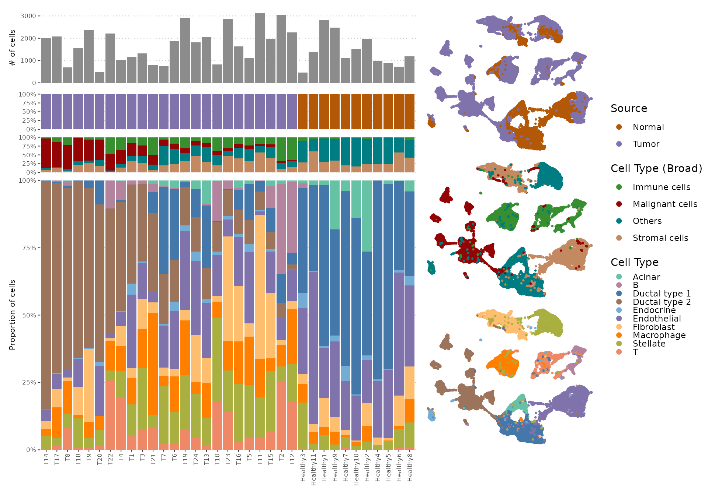

## Score cells with PhenoMapR

Because we have survival meta-z signatures from both TCGA and PRECOG
PAAD resources, we will score the expression matrix with both references
and compare. We then merge score columns into metadata for downstream
analysis.

``` r

# Score all cells against the TCGA PAAD meta-z signature
scores_tcga <- PhenoMap(expression = expr_mat, 
                        reference = "tcga", 
                        cancer_type = "PAAD", 
                        verbose = TRUE)
```

    ## 4844 genes used for scoring against PAAD
    ## Calculating scores...
    ## Completed scoring for PAAD

``` r

# Score all cells against the PRECOG Primary Pancreatic meta-z signature
scores_precog <- PhenoMap(expression = expr_mat, 
                          reference = "precog", 
                          cancer_type = "Pancreatic", 
                          verbose = TRUE)
```

    ## 6556 genes used for scoring against Pancreatic
    ## Calculating scores...
    ## Completed scoring for Pancreatic

``` r

for (col in names(scores_tcga)) meta[[col]] <- scores_tcga[meta$Cell, col]
for (col in names(scores_precog)) meta[[col]] <- scores_precog[meta$Cell, col]

score_tcga_col <- grep("PhenoMapR_.*PAAD", names(meta), value = TRUE, ignore.case = TRUE)[1]
score_precog_col <- grep("PhenoMapR_.*Pancreatic", names(meta), value = TRUE, ignore.case = TRUE)[1]
if (is.na(score_tcga_col)) score_tcga_col <- names(scores_tcga)[1]
if (is.na(score_precog_col)) score_precog_col <- names(scores_precog)[1]
```

## Compare TCGA vs PRECOG PhenoMapR scores

Here, we take the resulting **`PhenoMapR`** scores from using TCGA and
PRECOG as references and check to make sure they are correlated within
each of the four main cell type categories.

``` r

df_scatter <- data.frame(
  x = meta[[score_precog_col]],
  y = meta[[score_tcga_col]],
  Cell_Type = factor(meta$celltype_malignancy)
)

ggpubr::ggscatter(df_scatter, x = "x", y = "y", color = "Cell_Type", palette = malignant_colors,
    add = "reg.line", conf.int = TRUE, size = 0.5, alpha = 0.3) +
    ggpubr::stat_cor(aes(color = Cell_Type), label.x.npc = "left", size = 3.5, show.legend = F) +
  scale_color_manual(values = malignant_colors) +
  scale_fill_manual(values = malignant_colors) +
    scale_x_continuous("PRECOG score") +
    scale_y_continuous("TCGA score") +
    labs(title = "TCGA vs. PRECOG PhenoMapR scores by broad cell type") +
    theme_pubr(base_size = 10) +
    theme(legend.position = "right", legend.title = element_text(size = 12), legend.text = element_text(size = 10))
```

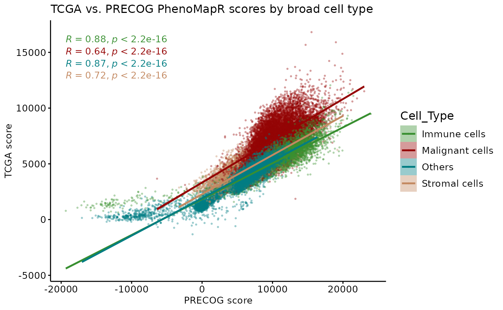

``` r

df_scatter <- data.frame(
  x = meta[[score_precog_col]],
  y = meta[[score_tcga_col]],
  Cell_Type = factor(meta$celltype_original)
)

ggpubr::ggscatter(df_scatter, x = "x", y = "y", color = "Cell_Type", palette = pal_cells,
    add = "reg.line", conf.int = TRUE, size = 0.5, alpha = 0.3) +
    ggpubr::stat_cor(aes(color = Cell_Type), label.x.npc = "left", size = 3.5, show.legend = F) +
  scale_color_manual(values = pal_cells) +
  scale_fill_manual(values = pal_cells) +
    scale_x_continuous("PRECOG score") +
    scale_y_continuous("TCGA score") +
    labs(title = "TCGA vs. PRECOG PhenoMapR scores by cell type") +
    theme_pubr(base_size = 10) +
    theme(legend.position = "right", legend.title = element_text(size = 12), legend.text = element_text(size = 10))
```

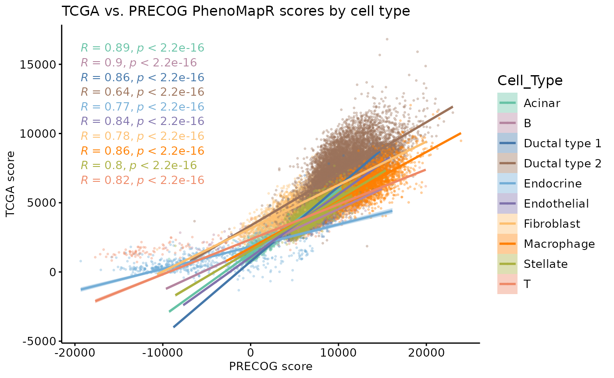

As expected, **`PhenoMapR`** scores are strongly correlated between TCGA
and PRECOG references across all major cell types.

## PhenoMapR score UMAP

``` r

# PRECOG
meta_ordered <- meta %>%
  arrange(abs(PhenoMapR_Pancreatic))

# scale the score for easier visualization
meta_ordered$score_scaled <- scale(meta_ordered$PhenoMapR_Pancreatic)

precog_scaled_umap <- ggscatter(meta_ordered,
          x = "UMAP_1", 
          y = "UMAP_2",
          size = 1,
          color = "score_scaled",
          legend = "right", 
          title = NULL
) + 
  scale_color_gradient2(
    low = "#2166AC",
    mid = "#F7F7F7",
    high = "#B2182B",
    midpoint = 0,  
    name = "PhenoMapR\nScore"
  ) +
  theme_void() +
    theme(plot.title = element_text(hjust = 0.5)) 

# Let's plot next to the cell type UMAP for comparison
(umap_2 | precog_scaled_umap) + 
  plot_layout(widths = c(1, 1))
```

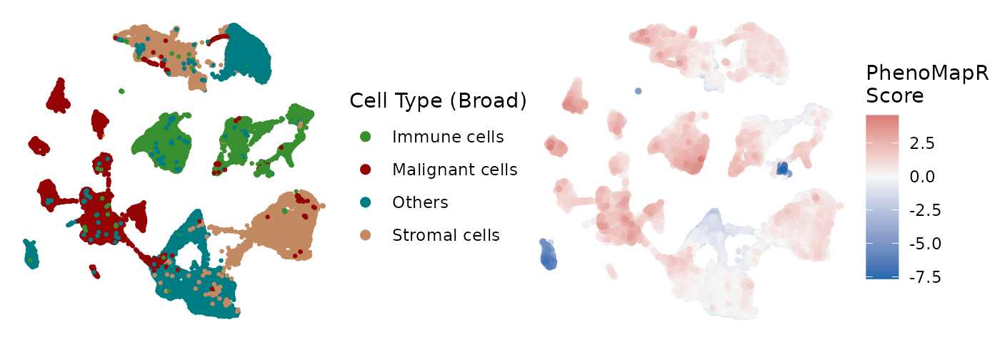 It seems like
the most adversely scoring cells are enriched in several of the Ductal
type 2 cell clusters while the most favorable are enriching in the
acinar and endocrine clusters.

## Prognostic score distribution by Cell Type

The qualitative assessment of PhenoMapR score enrichment across UMAP
clusters nominated some cell types as potentially more associated with
the phenotypic signature than others. Here, we plot the absolute
PhenoMapR score (PRECOG and TCGA scores) across all cell types in the
dataset.

``` r

med_precog <- setNames(
  tapply(meta[[score_precog_col]], meta$celltype_malignancy, median, na.rm = TRUE),
  levels(factor(meta$celltype_malignancy))
)
# med_precog <- med_precog[!is.na(med_precog)]
ct_order <- names(sort(med_precog))
meta$celltype_malignancy <- factor(meta$celltype_malignancy, levels = ct_order)

dl <- rbind(
  data.frame(Reference = "TCGA PAAD", Score = meta[[score_tcga_col]], Cell_type = meta$celltype_malignancy, stringsAsFactors = FALSE),
  data.frame(Reference = "PRECOG Pancreatic", Score = meta[[score_precog_col]], Cell_type = meta$celltype_malignancy, stringsAsFactors = FALSE)
)
dl$Reference <- factor(dl$Reference, levels = c("TCGA PAAD", "PRECOG Pancreatic"))
ggplot(dl, aes(x = Cell_type, y = Score, fill = Cell_type)) +
  # geom_boxplot(outlier.alpha = 0.2) +
  ggchicklet2::geom_chicklet_boxplot(radius = grid::unit(1, "pt"),outlier.alpha = 0.5, median.linewidth = 0.5,
                 outlier.fill = NULL,
                 outlier.color = NULL, outlier.shape = 21) +
  facet_wrap(~ Reference, ncol = 2) +
  scale_fill_manual(values = malignant_colors, name = "Cell Type (Broad)") +
  theme_pubr(base_size = 10) +
  theme(
    axis.text.x = element_text(angle = 45, hjust = 1),
        legend.position = "right", 
        strip.text = element_text(size = 12)) +
  labs(x = NULL, y = "PhenoMapR score", title = "Score distribution by reference and cell type")
```

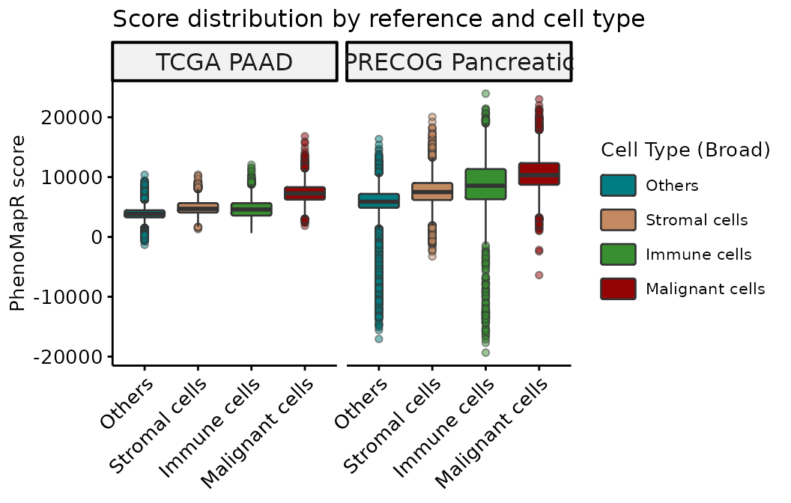

**`PhenoMapR`** successfully identifies the **Malignant** cell
compartment as most associated with the adverse prognostic signature in
both TCGA and PRECOG.

## Score distribution by refined cell type

To see if the **`PhenoMapR`** score assignment is enriched in more
granular cell types, we use the original cell type labels provided by
the authors (*Peng et al.* 2019).

``` r

med_precog <- setNames(
  tapply(meta[[score_precog_col]], meta$celltype_original, median, na.rm = TRUE),
  levels(factor(meta$celltype_original))
)
# med_precog <- med_precog[!is.na(med_precog)]
ct_order <- names(sort(med_precog))
meta$celltype_original <- factor(meta$celltype_original, levels = ct_order)

dl <- rbind(
  data.frame(Reference = "TCGA PAAD", Score = meta[[score_tcga_col]], Cell_type = meta$celltype_original, stringsAsFactors = FALSE),
  data.frame(Reference = "PRECOG Pancreatic", Score = meta[[score_precog_col]], Cell_type = meta$celltype_original, stringsAsFactors = FALSE)
)
dl$Reference <- factor(dl$Reference, levels = c("TCGA PAAD", "PRECOG Pancreatic"))
ggplot(dl, aes(x = Cell_type, y = Score, fill = Cell_type)) +
  # geom_boxplot(outlier.alpha = 0.2) +
  ggchicklet2::geom_chicklet_boxplot(radius = grid::unit(1, "pt"),
                                     outlier.alpha = 0.5, median.linewidth = 0.5,
                 outlier.fill = NULL,
                 outlier.color = NULL, outlier.shape = 21) +
  facet_wrap(~ Reference, ncol = 2) +
  scale_fill_manual(values = pal_cells, name = "Cell Type") +
  theme_pubr(base_size = 10) +
  theme(axis.text.x = element_text(angle = 45, hjust = 1), legend.position = "right", strip.text = element_text(size = 12)) +
  labs(x = NULL, y = "PhenoMapR score", title = "Score distribution by reference and cell type")
```

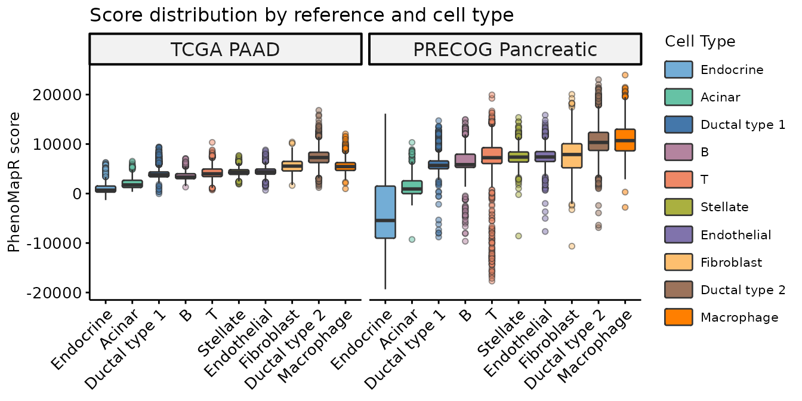

In both TCGA and PRECOG results, we see that the Ductal cell type 2 is
the most significantly associated cell type with an adverse prognostic
signature in PAAD. This agrees with the results from **SIDISH** [Jolasun
et al.](https://www.nature.com/articles/s41467-025-66162-4/figures/2),
where they find **over 55% of their high-risk cells were Ductal cell
type 2**.

## Score distribution by sample source

Theoretically, the PhenoMapR scores should be differentially distributed
between tumor or normal samples. We plot the scores per cell type, split
by tumor/normal source:

``` r

library(ggsignif)
library(purrr)
library(dplyr)

dl <- 
  data.frame(Reference = "PRECOG Pancreatic", Source = meta$Source, Score = meta[[score_precog_col]], Cell_type = meta$celltype_original, stringsAsFactors = FALSE)

cell_levels <- levels(factor(dl$Cell_type))  # or your factor order

# For each cell type, check which sources are present
source_offsets <- c("Normal" = -0.2, "Tumor" = 0.2)  # matches dodge width = 0.8 → each side ±0.2

# --- 2. Compute p-values per cell type ---
pval_df <- dl %>%
  group_by(Cell_type) %>%
  summarise(
    n_sources = n_distinct(Source),
    p_val = ifelse(
      n_distinct(Source) > 1,
      wilcox.test(scale(Score)[Source == "Normal"],
                  scale(Score)[Source == "Tumor"])$p.value,
      NA_real_
    ),
    .groups = "drop"
  ) %>%
  filter(!is.na(p_val)) %>%
  mutate(
    # Use the SAME factor used in ggplot
    x_pos  = as.integer(factor(Cell_type, levels = levels(factor(dl$Cell_type)))),
    xmin   = x_pos - 0.2,
    xmax   = x_pos + 0.2,
    # Per-group y_pos based on actual data max for that cell type
    y_pos  = max(scale(dl$Score), na.rm = TRUE) * 1.05,
    label  = case_when(
      p_val < 0.001 ~ "***",
      p_val < 0.01  ~ "**",
      p_val < 0.05  ~ "*",
      TRUE          ~ "ns"
    )
  )

# --- 3. Plot ---
ggplot(dl, aes(x = Cell_type, y = scale(Score), fill = Cell_type, color = Source)) +
  # geom_boxplot(outlier.alpha = 0.2, position = position_dodge(width = 0.8)) +
    #   geom_boxplot(outlier.alpha = 0.5, median.linewidth = 0.5,
    #              outlier.fill = NULL,
    #              outlier.color = NULL, outlier.shape = 21) +
    # # geom_boxplot(outlier.alpha = 0.2) +
  ggchicklet2::geom_chicklet_boxplot(radius = grid::unit(1, "pt"),
                                     outlier.alpha = 0.5, median.linewidth = 0.5,
                 outlier.fill = NULL,
                 outlier.color = NULL, outlier.shape = 21) +
  geom_signif(
    data        = pval_df,
    aes(xmin = xmin, xmax = xmax, annotations = label, y_position = y_pos),
    manual      = TRUE,
    tip_length  = 0.02,
    textsize    = 4,
    color       = "black",   # override the color aes from the main plot
    inherit.aes = T
  ) +
  scale_fill_manual(values = pal_cells, name = "\nCell Type") +
  scale_color_manual(values = c("Normal" = "lightgrey", "Tumor" = "black"), name = "Source") +
  guides(
    fill  = guide_legend(order = 1),
    color = guide_legend(order = 2)
  ) +
  theme_pubr(base_size = 14) +
  theme(
    axis.text.x     = element_text(angle = 45, hjust = 1),
    legend.position = "right",
    strip.text      = element_text(size = 12),
    plot.title      = element_text(hjust = 0.5)
  ) +
  labs(x = NULL, y = "PhenoMapR score (scaled)", title = "PhenoMapR Score distribution by Source and Cell Type")
```

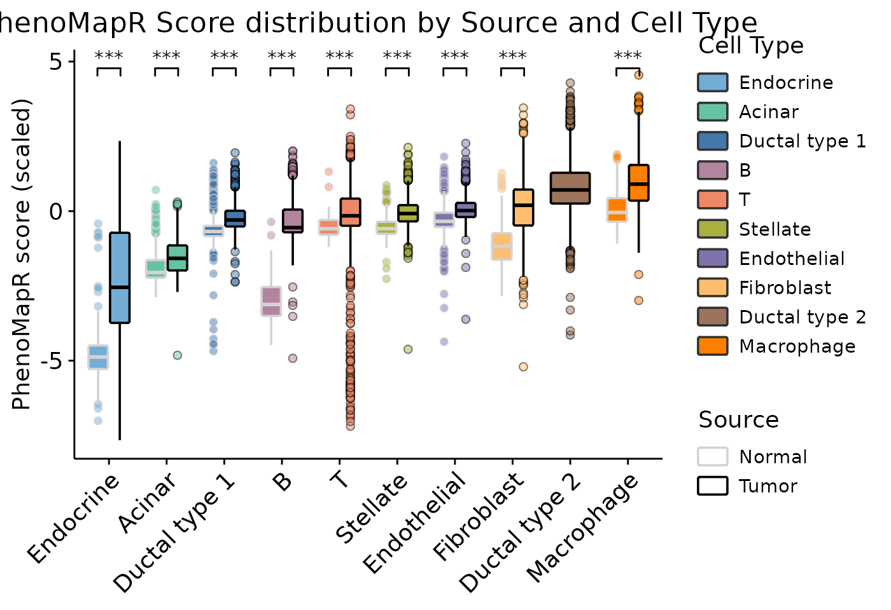 Indeed, tumor
samples are significantly enriched for more adverse scores across all
cell types except B cells.

## Cell types in the most prognostic populations

Cell type counts in the top 5% (Most Adverse) and bottom 5% (Most
Favorable) of cells by PRECOG score.

``` r

scores_tail <- meta[, score_precog_col, drop = FALSE]
rownames(scores_tail) <- meta$Cell
groups_tail <- define_phenotype_groups(
  scores_tail,
  percentile = 0.05,
  score_columns = score_precog_col
)
tail_col <- grep("^phenotype_group_", names(groups_tail), value = TRUE)[1]
pg_tmp <- groups_tail[[tail_col]][match(meta$Cell, groups_tail$cell_id)]
idx_extreme <- pg_tmp %in% c("Most Adverse", "Most Favorable")

ct_in_extreme <- meta[idx_extreme, , drop = FALSE]
ct_in_extreme$pg <- pg_tmp[idx_extreme]
ct_counts <- as.data.frame(
  table(Cell_type = ct_in_extreme$celltype_malignancy, pg = ct_in_extreme$pg),
  stringsAsFactors = FALSE
)
ct_wide <- tidyr::pivot_wider(
  ct_counts,
  names_from = pg,
  values_from = Freq,
  values_fill = 0
)
for (c in c("Most Adverse", "Most Favorable")) {
  if (!c %in% names(ct_wide)) ct_wide[[c]] <- 0L
}
ct_wide <- ct_wide[order(ct_wide[["Most Adverse"]], decreasing = TRUE), , drop = FALSE]
ct_long <- rbind(
  data.frame(Cell_type = ct_wide$Cell_type, pg = "Most Favorable", n = -ct_wide[["Most Favorable"]]),
  data.frame(Cell_type = ct_wide$Cell_type, pg = "Most Adverse", n = ct_wide[["Most Adverse"]])
)
ct_long$pg <- factor(ct_long$pg, levels = c("Most Favorable", "Most Adverse"))
max_n <- max(abs(ct_long$n), 1)
ggplot(ct_long, aes(x = Cell_type, y = n, fill = pg)) +
  geom_col(width = 0.75) +
  coord_flip() +
  scale_fill_manual(
    values = c(`Most Adverse` = "#B2182B", `Most Favorable` = "#2166AC"),
    name = "Prognostic group"
  ) +
  scale_y_continuous(
    breaks = seq(-max_n, max_n, length.out = 5),
    labels = abs(seq(-max_n, max_n, length.out = 5))
  ) +
  theme_pubr(base_size = 10) +
  theme(
    axis.text.y = element_text(size = 9),
    legend.position = c(.8, .7),
    plot.title = element_text(hjust = 0.5, size = 10)
  ) +
  labs(
    x = NULL,
    y = "Cell count (in 5th percentile)",
    title = "Broad cell type abundance in \nadverse vs. favorable extremes"
  )
```

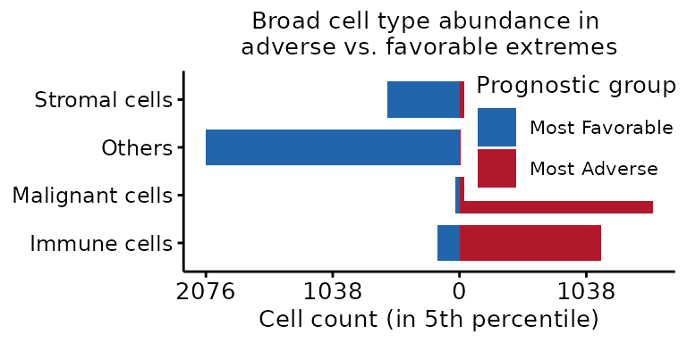
At a broad cell type level, PhenoMapR assigns the vast majority of the
top 5% of adverse cells to the malignant compartment, however the
immune, stromal, and other cell types do contain some of the most
adversely scoring cells.

We then use the original cell type annotations from the authors to
provide a more refined understanding of the prognostic score assignment
across cell types.

``` r

ct_orig_in_extreme <- meta[idx_extreme, , drop = FALSE]
ct_orig_in_extreme$pg <- pg_tmp[idx_extreme]
ct_orig_counts <- as.data.frame(
  table(Cell_type_original = ct_orig_in_extreme$celltype_original, pg = ct_orig_in_extreme$pg),
  stringsAsFactors = FALSE
)
ct_orig_wide <- tidyr::pivot_wider(
  ct_orig_counts,
  names_from = pg,
  values_from = Freq,
  values_fill = 0
)
for (c in c("Most Adverse", "Most Favorable")) {
  if (!c %in% names(ct_orig_wide)) ct_orig_wide[[c]] <- 0L
}
ct_orig_wide <- ct_orig_wide[order(ct_orig_wide[["Most Adverse"]], decreasing = TRUE), , drop = FALSE]
ct_orig_long <- rbind(
  data.frame(Cell_type_original = ct_orig_wide$Cell_type_original, pg = "Most Favorable", n = -ct_orig_wide[["Most Favorable"]]),
  data.frame(Cell_type_original = ct_orig_wide$Cell_type_original, pg = "Most Adverse", n = ct_orig_wide[["Most Adverse"]])
)
ct_orig_long$pg <- factor(ct_orig_long$pg, levels = c("Most Favorable", "Most Adverse"))
max_n_orig <- max(abs(ct_orig_long$n), 1)
ggplot(ct_orig_long, aes(x = Cell_type_original, y = n, fill = pg)) +
  geom_col(width = 0.75) +
  coord_flip() +
  scale_fill_manual(
    values = c(`Most Adverse` = "#B2182B", `Most Favorable` = "#2166AC"),
    name = "Prognostic group"
  ) +
  scale_y_continuous(
    breaks = round(seq(-max_n_orig, max_n_orig, length.out = 5)),
    labels = abs(round(seq(-max_n_orig, max_n_orig, length.out = 5)))
  ) +
  theme_pubr(base_size = 10) +
  theme(
    axis.text.y = element_text(size = 9),
    legend.position = c(.8, .75),
    plot.title = element_text(hjust = 0.5, size = 10)
  ) +
  labs(
    x = NULL,
    y = "Cell count (in 5th percentile)",
    title = "Cell Type abundance in adverse\nvs. favorable extremes"
  )
```

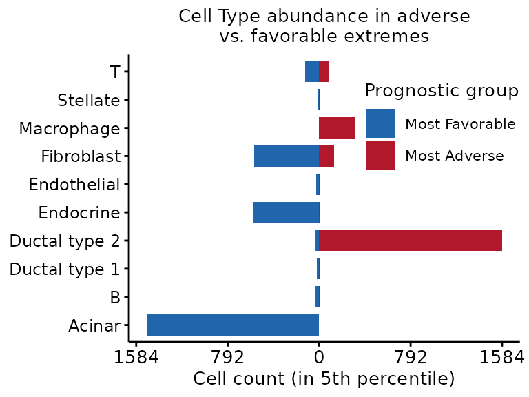
Here, we see that the vase majority of the top 5th percentile of adverse
PhenoMapR cells are from the Ductal type 2 cells, in line with the
results of [Jolasun et
al.](https://www.nature.com/articles/s41467-025-66162-4/figures/2). The
majority of favorably scoring cells were Acinar and B cell populations.

## Phenotype groups and marker genes

**`PhenoMapR`** provides some high-level analysis functions to help
characterize the most phenotypically relevant cells. We define the “Most
Adverse” and “Most Favorable” cells from the **PRECOG PhenoMapR** score
(5th/95th percentiles), then run marker identification (adverse vs rest,
favorable vs rest) using the original cell type annotation for context.

``` r

scores_df <- meta[, c(score_tcga_col, score_precog_col), drop = FALSE]
rownames(scores_df) <- meta$Cell
groups <- define_phenotype_groups(
  scores_df,
  percentile = 0.05,
  score_columns = score_precog_col
)
group_col <- grep("^phenotype_group_", names(groups), value = TRUE)[1]
meta[[group_col]] <- groups[[group_col]][match(meta$Cell, groups$cell_id)]

group_df <- data.frame(
  cell_id = meta$Cell,
  phenotype_group = meta[[group_col]],
  cell_type = meta$celltype_original,
  stringsAsFactors = FALSE
)

markers <- find_phenotype_markers(
  expr_mat,
  group_labels = group_df,
  group_column = "phenotype_group",
  cell_id_column = "cell_id",
  marker_scope = "phenotype_groups",
  pval_threshold = 0.05,
  max_cells_per_ident = 5000L,
  verbose = FALSE
)
if (!is.null(markers)) {
  message("Adverse markers (top 5):"); print(head(markers$adverse_markers, 5))
  message("Favorable markers (top 5):"); print(head(markers$favorable_markers, 5))
}
```

    ##          gene avg_log2FC pct_in_group  pct_rest p_val p_adj
    ## 126      ENO1  13.623106     96.31048 66.391464     0     0
    ## 244       CDA   1.675788     46.18865  7.900419     0     0
    ## 323  SH3BGRL3  15.462975     98.46850 75.142893     0     0
    ## 540    SLC2A1   1.803979     52.24504 12.257081     0     0
    ## 1096  S100A10  29.761667     99.72155 87.057030     0     0

    ##           gene avg_log2FC pct_in_group pct_rest p_val p_adj
    ## 21192     ENO1  -7.976144     50.05221 83.27194     0     0
    ## 21295    CAPZB  -2.413023     44.97041 76.60358     0     0
    ## 21325    CDC42  -2.957609     56.21302 82.63686     0     0
    ## 21389 SH3BGRL3 -11.537925     60.80752 88.88607     0     0
    ## 21568     CAP1  -2.646242     36.16429 74.45700     0     0

## Marker genes heatmap

After identifying marker genes for the adverse and favorable
**`PhenoMapR`** populations, we take up to **10** positive markers per
tail with **FDR \< 0.05** and the **largest `avg_log2FC`** (same
thresholds as the cell-type–specific heatmap). The helper
**[`plot_phenotype_markers()`](https://brooksbenard.github.io/PhenoMapR/reference/plot_phenotype_markers.md)**
subsets the expression matrix to those genes and the ordered cells, then
applies **row-wise `scale`** only to that submatrix. **ComplexHeatmap**
shows favorable-marker rows, then adverse-marker rows, with
**`anno_mark`** for the top five genes in each block.

``` r

plot_phenotype_markers(
    markers = markers,
    expr_mat = expr_mat,
    meta = meta,
    cell_id_col = "Cell",
    group_col = group_col,
    score_col = score_precog_col,
    celltype_col = "celltype_original",
    celltype_palette = pal_cells,
    heatmap_type = "global",
    top_n_markers = 10L,
    n_mark_labels = 10L,
    p_adj_threshold = 0.05
  )
```

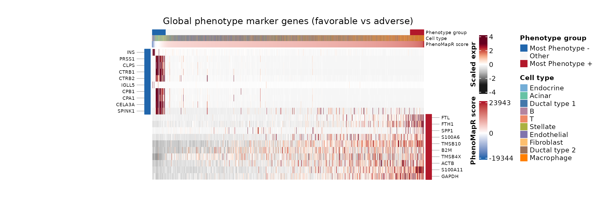 It’s clear from
the heatmap that the cell type driving the favorable prognostic signal
is the Acinar cell type. Cell-type specific marker identification within
the most prgnostic group would further resolve other cell type markers
associated with favorable outcomes in this dataset.

## Cell-type-specific phenotype marker genes

The
[`find_phenotype_markers()`](https://brooksbenard.github.io/PhenoMapR/reference/find_phenotype_markers.md)
function can also identify marker genes **for each cell type** by
contrasting cells in the phenotype tails (Most Adverse or Most
Favorable) against a reference group. By default
(`celltype_contrast = "within_cell_type"`), the reference is **only
other cells of the same type** (`Other` and the opposite tail)—this
reduces ubiquitous genes appearing in many blocks. The **original**
cohort-wide contrast `(cell type ∩ tail)` vs **all other cells** is
available as `celltype_contrast = "vs_cohort_rest"`. By default
(`celltype_unique_genes = TRUE`), each gene is kept in a **single**
cell-type–phenotype block (the one with the strongest `avg_log2FC`), so
ubiquitous transcripts are not repeated across many blocks. We visualize
the top marker genes per cell type and phenotype bin in a heatmap that
includes *all* cells, ordered by: 1) phenotype bin (Most Favorable,
Other, Most Adverse), then 2) cell type, then 3) phenotype score.

For the heatmap, we take up to **20** positive markers per cell type and
phenotype tail with the **largest `avg_log2FC`**, restricting to genes
that are **FDR-significant** (`p_adj` from Benjamini–Hochberg `< 0.05`).
Rows follow the same column order: **Most Favorable** (each cell type),
**Other** cells, **Most Adverse** (each cell type).
**`plot_phenotype_markers(..., heatmap_type = "cell_type_specific")`**
draws row splits between blocks; **`anno_mark`** labels the **top five**
genes (by log2FC) within each (phenotype tail × cell type) group, with
**cell type** and **phenotype** strips on the left. Setting
**`color_mark_labels_by_celltype = TRUE`** colors each labeled gene with
its cell-type palette so markers are easier to read against the strips.

``` r

markers_ct <- find_phenotype_markers(
  expr_mat,
  group_labels = group_df,
  group_column = "phenotype_group",
  cell_id_column = "cell_id",
  cell_type_column = "cell_type",
  marker_scope = "cell_type_specific",
  celltype_contrast = "within_cell_type",
  pval_threshold = 0.05,
  max_cells_per_ident = 5000L,
  verbose = FALSE
)

plot_phenotype_markers(
  markers = markers_ct,
  expr_mat = expr_mat,
  meta = meta,
  cell_id_col = "Cell",
  group_col = group_col,
  score_col = score_precog_col,
  celltype_col = "celltype_original",
  celltype_palette = pal_cells,
  heatmap_type = "cell_type_specific",
  celltype_contrast = "within_cell_type",
  top_n_markers = 10L,
  n_mark_labels = 5L,
  color_mark_labels_by_celltype = TRUE,
  p_adj_threshold = 0.05,
  outline_marker_blocks = TRUE
)
```

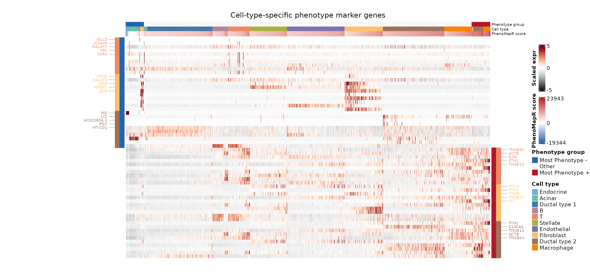

``` r

markers_ct_vs_tail <- find_phenotype_markers(
  expr_mat,
  group_labels = group_df,
  group_column = "phenotype_group",
  cell_id_column = "cell_id",
  cell_type_column = "cell_type",
  marker_scope = "cell_type_specific",
  celltype_contrast = "vs_opposite_tail",
  pval_threshold = 0.05,
  max_cells_per_ident = 5000L,
  verbose = FALSE
)

plot_phenotype_markers(
  markers = markers_ct_vs_tail,
  expr_mat = expr_mat,
  meta = meta,
  cell_id_col = "Cell",
  group_col = group_col,
  score_col = score_precog_col,
  celltype_col = "celltype_original",
  celltype_palette = pal_cells,
  heatmap_type = "cell_type_specific",
  celltype_contrast = "vs_opposite_tail",
  outline_marker_blocks = TRUE,
  block_outline_color = "black",
  top_n_markers = 5L,
  n_mark_labels = 5L,
  color_mark_labels_by_celltype = TRUE,
  p_adj_threshold = 0.05
)
```

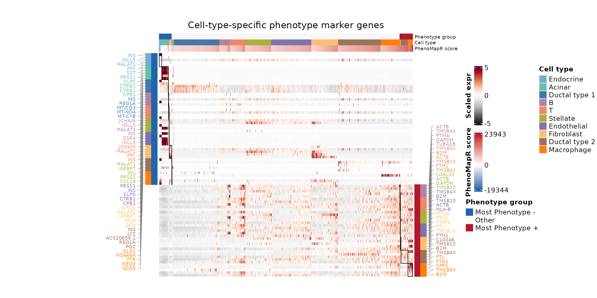

## Dataset summary of PhenoMapR results

Here, we summarize the enrichment of prognostic PhenoMapR scores across
samples and cell types to highlight the difference in signal between
healthy and tumor samples as well as between different cell populations
across the sample groups. The **top panel** shows **one PRECOG score per
pseudo-bulk sample profile** without building a **`Seurat`** object: we
map each cell’s barcode to a sample ID (same column used elsewhere in
this figure), **sum counts per gene across all cells in that sample**,
and assemble a **genes × samples** table (`expr_agg_df`, one column per
sample). That object is the usual **bulk-style** input to
**[`PhenoMap()`](https://brooksbenard.github.io/PhenoMapR/reference/PhenoMap.md)**
(rows = genes, columns = samples), so each column is scored once with
the same weighted-sum PRECOG logic used for bulk data. (The
**`pseudobulk = TRUE`** argument applies when **`PhenoMap`** aggregates
from a **`Seurat`** object; here aggregation is explicit in the table,
which avoids large **`Seurat`** allocations and matches
**sum-per-sample** pseudo-bulk expression.) Values are **z-scaled across
samples** so bars are comparable for relative high/low bulk-like signal
per sample. The **stacked bar** uses the same **5th / 95th percentile**
PRECOG tails as elsewhere in the vignette
(**`define_phenotype_groups(..., percentile = 0.05)`**), applied again
in this chunk so every cell receives a **Most Adverse**, **Most
Favorable**, or **Other** label and **per-sample proportions of tail
cells always sum sensibly** over the full cohort. **All panels share one
sample axis order** (`sample_lev`): factor **levels** are used when the
sample column is already a factor (e.g. **`Patient`** after ordering
earlier in the vignette); otherwise **first appearance in `meta`**.
**[`merge()`](https://rdrr.io/r/base/merge.html)** output for bar
heights is **re-sorted** to that order so horizontal positions match the
pseudo-bulk and dot plots.

``` r

sample_col <- NULL
for (cand in c("Sample", "sample", "Patient", "patient", "Sample_ID", "orig.ident")) {
  if (cand %in% names(meta)) {
    sample_col <- cand
    break
  }
}
if (is.null(sample_col)) sample_col <- names(meta)[1]

meta_plot <- meta
meta_plot$sample <- meta_plot[[sample_col]]
meta_plot$cell_type <- meta_plot$celltype_malignancy
# meta_plot$cell_type_original <- if (!is.null(celltype_original) && celltype_original %in% names(meta_plot)) meta_plot$celltype_original else NA_character_
meta_plot$cell_type_original <- meta$celltype_original
## Tail labels for p_bar / dots: same rule as marker chunk (5% / 95% on PRECOG score), keyed by Cell
scores_tail <- meta[, score_precog_col, drop = FALSE]
rownames(scores_tail) <- meta$Cell
groups_tail <- define_phenotype_groups(scores_tail, percentile = 0.05, score_columns = score_precog_col)
tail_col_bar <- grep("^phenotype_group_", names(groups_tail), value = TRUE)[1]
meta_plot$prognostic_grp <- unname(groups_tail[as.character(meta_plot$Cell), tail_col_bar])
## Canonical sample order for every panel: preserve factor levels if set upstream (e.g. Patient),
## else first appearance in `meta` (stable, not alphabetical).
sc_ids <- meta[[sample_col]]
sample_lev <- if (is.factor(sc_ids)) {
  levels(droplevels(sc_ids))
} else {
  unique(as.character(sc_ids))
}
meta_plot$sample <- factor(as.character(meta_plot[[sample_col]]), levels = sample_lev)
n_per_sample <- setNames(as.numeric(table(meta[[sample_col]])[sample_lev]), sample_lev)
n_per_sample[is.na(n_per_sample)] <- 0

## Pseudo-bulk table: cell → sample mapping, sum counts per gene per sample, score with PhenoMap (no Seurat)
cells_pb <- intersect(colnames(expr_mat), meta$Cell)
expr_pb <- expr_mat[, cells_pb, drop = FALSE]
meta_pb <- meta[match(cells_pb, meta$Cell), , drop = FALSE]
rownames(meta_pb) <- cells_pb
sample_ids <- as.character(meta_pb[[sample_col]])
ns <- length(sample_lev)
pb_mat <- matrix(
  0,
  nrow = nrow(expr_pb),
  ncol = ns,
  dimnames = list(rownames(expr_pb), as.character(sample_lev))
)
col_filled <- rep(FALSE, ns)
for (j in seq_len(ns)) {
  idx <- sample_ids == as.character(sample_lev[j])
  if (!any(idx)) next
  col_filled[j] <- TRUE
  sm <- expr_pb[, idx, drop = FALSE]
  pb_mat[, j] <- if (inherits(sm, "Matrix") || inherits(sm, "sparseMatrix")) {
    as.numeric(Matrix::rowSums(sm))
  } else {
    rowSums(sm)
  }
}
expr_agg_df <- as.data.frame(pb_mat, stringsAsFactors = FALSE, check.names = FALSE)
scores_precog_pb <- PhenoMap(
  expression = expr_agg_df,
  reference = "precog",
  cancer_type = "Pancreatic",
  verbose = FALSE
)
pb_score_col <- if (score_precog_col %in% names(scores_precog_pb)) {
  score_precog_col
} else {
  grep("^PhenoMapR_", names(scores_precog_pb), value = TRUE)[1]
}
pb_mean <- as.numeric(scores_precog_pb[[pb_score_col]][match(as.character(sample_lev), rownames(scores_precog_pb))])
pb_mean[!col_filled] <- NA_real_
ok_pb <- is.finite(pb_mean)
pb_scaled <- rep(NA_real_, length(pb_mean))
if (sum(ok_pb) >= 2L && stats::sd(pb_mean[ok_pb], na.rm = TRUE) > 0) {
  pb_scaled[ok_pb] <- as.numeric(scale(pb_mean[ok_pb]))
} else if (any(ok_pb)) {
  pb_scaled[ok_pb] <- 0
}
pb_df <- data.frame(
  sample = factor(sample_lev, levels = sample_lev),
  pb_score_scaled = pb_scaled,
  stringsAsFactors = FALSE
)
p_pbulk <- ggplot(pb_df, aes(x = .data$sample, y = .data$pb_score_scaled, fill = .data$pb_score_scaled)) +
  geom_col(width = 0.85, na.rm = FALSE) +
  scale_fill_gradient2(
    low = "#2166AC",
    mid = "#FFFFFF",
    high = "#B2182B",
    midpoint = 0,
    na.value = "#d9d9d9",
    guide = "none"
  ) +
  geom_hline(yintercept = 0, linewidth = 0.35, linetype = "dashed", color = "grey40") +
  scale_x_discrete(drop = FALSE) +
  scale_y_continuous(expand = expansion(mult = c(0.08, 0.08))) +
  theme_minimal() +
  theme(
    axis.text.x = element_blank(),
    axis.ticks.x = element_blank(),
    axis.title.x = element_blank(),
    legend.position = "none"
  ) +
  labs(y = "Sample\nPseudobulk\nscore", title = NULL)

# Per-sample proportion of adverse and favorable (5th / 95th % tails on PRECOG) for stacked bar
meta_adv_fav <- meta_plot[meta_plot$prognostic_grp %in% c("Most Adverse", "Most Favorable"), ]
bar_df <- as.data.frame(table(sample = meta_adv_fav$sample, pg = meta_adv_fav$prognostic_grp, useNA = "no"))
bar_df <- bar_df[bar_df$pg %in% c("Most Adverse", "Most Favorable"), ]
bar_df$total <- n_per_sample[as.character(bar_df$sample)]
bar_df$proportion <- ifelse(bar_df$total > 0, bar_df$Freq / bar_df$total, 0)
fav <- bar_df[bar_df$pg == "Most Favorable", c("sample", "proportion")]
adv <- bar_df[bar_df$pg == "Most Adverse", c("sample", "proportion")]
names(fav)[2] <- "p_fav"
names(adv)[2] <- "p_adv"
bar_stack <- merge(data.frame(sample = sample_lev, stringsAsFactors = FALSE), fav, by = "sample", all.x = TRUE)
bar_stack <- merge(bar_stack, adv, by = "sample", all.x = TRUE)
bar_stack$p_fav[is.na(bar_stack$p_fav)] <- 0
bar_stack$p_adv[is.na(bar_stack$p_adv)] <- 0
## merge() sorts by `by`; restore cohort order so x positions match p_pbulk and dot plots
bar_stack <- bar_stack[match(sample_lev, as.character(bar_stack$sample)), , drop = FALSE]
bar_stack$sample <- factor(bar_stack$sample, levels = sample_lev)

# Stacked bar: per-sample fraction of cohort tail cells (from define_phenotype_groups above)
bar_long <- rbind(
  data.frame(sample = bar_stack$sample, pg = "Most Favorable", proportion = bar_stack$p_fav),
  data.frame(sample = bar_stack$sample, pg = "Most Adverse", proportion = bar_stack$p_adv)
)
bar_long$pg <- factor(bar_long$pg, levels = c("Most Favorable", "Most Adverse"))
bar_long$sample <- factor(as.character(bar_long$sample), levels = sample_lev)

p_bar <- ggplot(bar_long, aes(x = sample, y = proportion, fill = pg)) +
  geom_col(width = 0.85, position = "stack") +
  scale_fill_manual(values = c(`Most Adverse` = "#B2182B", `Most Favorable` = "#2166AC"),
                    name = "Prognostic group") +
  scale_x_discrete(drop = FALSE) +
  scale_y_continuous(expand = c(0, 0)) +
  theme_minimal() +
  theme(
    axis.text.x  = element_blank(),
    axis.ticks.x = element_blank(),
    axis.title.x = element_blank(),
    legend.position = "none"
  ) +
  labs(y = "Proportion\nof cells\n(in 5th %)", title = NULL)

meta_plot_dots <- meta_plot[meta_plot$prognostic_grp %in% c("Most Adverse", "Most Favorable"), ]
p_dots <- NULL
p_dots_orig <- NULL
if (nrow(meta_plot_dots) > 0) {
  ## Full `sample_lev` level order so x positions match p_pbulk / p_bar (subset can drop unused levels)
  meta_plot_dots$sample <- factor(as.character(meta_plot_dots$sample), levels = sample_lev)
  meta_plot_dots$cell_type <- factor(meta_plot_dots$cell_type)
  counts <- as.data.frame(table(meta_plot_dots$sample, meta_plot_dots$cell_type, meta_plot_dots$prognostic_grp, dnn = c("sample", "cell_type", "pg")))
  totals <- aggregate(counts$Freq, by = list(sample = counts$sample, pg = counts$pg), FUN = sum)
  names(totals)[3] <- "total"
  counts <- merge(counts, totals, by = c("sample", "pg"))
  counts$proportion <- counts$Freq / counts$total
  counts$proportion[counts$total == 0] <- 0
  counts$sample <- factor(as.character(counts$sample), levels = sample_lev)
  counts$x_num <- as.numeric(counts$sample) + ifelse(counts$pg == "Most Adverse", -0.18, 0.18)

  p_dots <- ggplot(counts, aes(x = x_num, y = cell_type, size = proportion, color = pg)) +
    geom_point(alpha = 0.85) +
    scale_color_manual(values = c(`Most Adverse` = "#B2182B", `Most Favorable` = "#2166AC"), name = "Prognostic group") +
    scale_size_continuous(range = c(0, 5), name = "Proportion of cell type\nper sample in\nprognostic groups") +
    scale_x_continuous(
      breaks = seq_along(sample_lev),
      labels = sample_lev,
      limits = c(0.5, length(sample_lev) + 0.5),
      expand = c(0, 0)
    ) +
    theme_minimal() +
    theme(panel.grid.major.y = element_line(color = "grey90"), 
          axis.title = element_text(size = 10), 
          axis.text.x = element_blank(), 
          axis.ticks.x = element_blank(), 
          legend.title = element_text(hjust = 0.5),
          legend.position = "right") +
    guides(
  color = guide_legend(override.aes = list(size = 3)),
  # size  = guide_legend(override.aes = list(size = c(2, 3, 4, 5, 6)))
) +
    labs(x = NULL, y = "Cell type\n(broad)", title = NULL)

  if (!all(is.na(meta_plot_dots$cell_type_original))) {
    meta_plot_dots$cell_type_original <- factor(meta_plot_dots$cell_type_original)
    counts_orig <- as.data.frame(table(meta_plot_dots$sample, meta_plot_dots$cell_type_original, meta_plot_dots$prognostic_grp, dnn = c("sample", "cell_type_original", "pg")))
    totals_orig <- aggregate(counts_orig$Freq, by = list(sample = counts_orig$sample, pg = counts_orig$pg), FUN = sum)
    names(totals_orig)[3] <- "total"
    counts_orig <- merge(counts_orig, totals_orig, by = c("sample", "pg"))
    counts_orig$proportion <- counts_orig$Freq / counts_orig$total
    counts_orig$proportion[counts_orig$total == 0] <- 0
    counts_orig$sample <- factor(as.character(counts_orig$sample), levels = sample_lev)
    counts_orig$x_num <- as.numeric(counts_orig$sample) + ifelse(counts_orig$pg == "Most Adverse", -0.18, 0.18)

    p_dots_orig <- ggplot(counts_orig, aes(x = x_num, y = cell_type_original, size = proportion, color = pg)) +
      geom_point(alpha = 0.85) +
      scale_color_manual(values = c(`Most Adverse` = "#B2182B", `Most Favorable` = "#2166AC"), name = "Prognostic group") +
      scale_size_continuous(range = c(0, 5), name = "Proportion") +
      scale_x_continuous(
        breaks = seq_along(sample_lev),
        labels = sample_lev,
        limits = c(0.5, length(sample_lev) + 0.5),
        expand = c(0, 0)
      ) +
      theme_minimal() +
      theme(panel.grid.major.y = element_line(color = "grey90"), axis.title = element_text(size = 10),
            axis.text.x = element_text(angle = 90, hjust = 1, vjust = 0.5),
            legend.position = "none") +
      labs(x = "Sample", y = "Cell type\n(detailed)", title = NULL) +
      guides(color = guide_legend(override.aes = list(size = 3)))
  }
} else {
  warning("No cells labeled Most Adverse or Most Favorable after define_phenotype_groups; check PRECOG scores (e.g. all NA). Cell-type dot panels omitted.")
}

if (requireNamespace("patchwork", quietly = TRUE)) {
  suppressPackageStartupMessages(library(patchwork))
  if (!is.null(p_dots_orig)) {
    print(p_pbulk / p_bar / p_dots / p_dots_orig + plot_layout(heights = c(0.75, 1, 1, 2)))
  } else if (!is.null(p_dots)) {
    print(p_pbulk / p_bar / p_dots + plot_layout(heights = c(0.75, 1, 2)))
  } else {
    print(p_pbulk / p_bar + plot_layout(heights = c(0.75, 1)))
  }
} else {
  print(p_pbulk)
  print(p_bar)
  if (!is.null(p_dots)) print(p_dots)
  if (!is.null(p_dots_orig)) print(p_dots_orig)
}
```

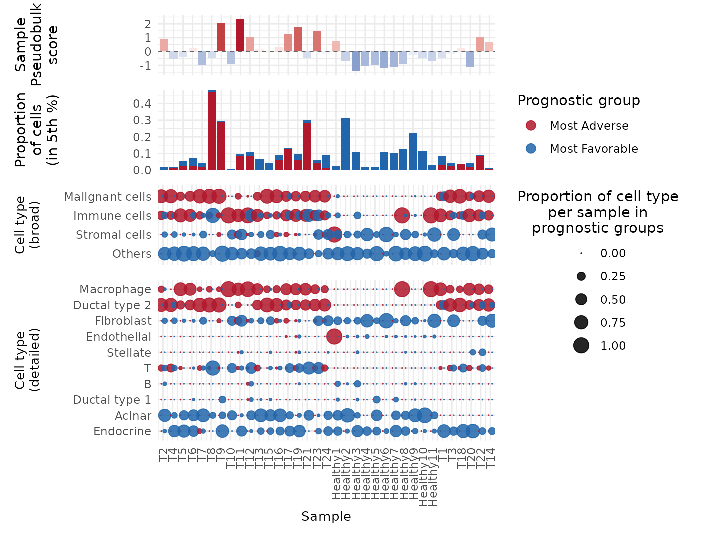

## Conclusions

Here, we demonstrate that using **`PhenoMapR`** on single-cell RNAseq
data in a pancreatic cancer dataset successfully identified cells known
to be associated with disease (primarily Malignant and Ductal type 2).
These results agree with those of [Jolasun et
al.](https://www.nature.com/articles/s41467-025-66162-4/figures/2),
however our **`PhenoMapR`** results provide an increased level of
granularity compared to other methods, since we retain absolute and
rank-ordered information regarding all cell’s phenotype association. We
also nominate cells most associated with favorable outcomes in PAAD,
highlighting potential areas for additional therapeutic focus.

## References

**\[1\]** Peng, J. et al. Single-cell RNA-seq highlights intra-tumoral
heterogeneity and malignant progression in pancreatic ductal
adenocarcinoma. *Cell Research* 29, 725–738 (2019).
<https://doi.org/10.1038/s41422-019-0195-y>

**\[2\]** Han, Y. et al. TISCH2: expanded datasets and new tools for
single-cell transcriptome analyses of the tumor microenvironment.
*Nucleic Acids Res* 51, D1425–D1431 (2023).
<https://doi.org/10.1093/nar/gkac959>

**\[3\]** Benard, B. et al. PRECOG update: an augmented resource of
clinical outcome associations with gene expression for adult, pediatric,
and immunotherapy cohorts. *Nucleic Acids Res.* 54, D1579–D1589 (2026).
<https://doi.org/10.1093/nar/gkaf1215>

**\[4\]** Jolasun, Y. et al. SIDISH integrates single-cell and bulk
transcriptomics to identify high-risk cells and guide precision
therapeutics through in silico perturbation. *Nat Commun* 16, 11271
(2025). <https://doi.org/10.1038/s41467-025-66162-4>

## Session Info

``` r

sessionInfo()
```

    ## R version 4.6.1 (2026-06-24)
    ## Platform: x86_64-pc-linux-gnu
    ## Running under: Ubuntu 24.04.4 LTS
    ## 
    ## Matrix products: default
    ## BLAS:   /usr/lib/x86_64-linux-gnu/openblas-pthread/libblas.so.3 
    ## LAPACK: /usr/lib/x86_64-linux-gnu/openblas-pthread/libopenblasp-r0.3.26.so;  LAPACK version 3.12.0
    ## 
    ## locale:
    ##  [1] LC_CTYPE=C.UTF-8       LC_NUMERIC=C           LC_TIME=C.UTF-8       
    ##  [4] LC_COLLATE=C.UTF-8     LC_MONETARY=C.UTF-8    LC_MESSAGES=C.UTF-8   
    ##  [7] LC_PAPER=C.UTF-8       LC_NAME=C              LC_ADDRESS=C          
    ## [10] LC_TELEPHONE=C         LC_MEASUREMENT=C.UTF-8 LC_IDENTIFICATION=C   
    ## 
    ## time zone: UTC
    ## tzcode source: system (glibc)
    ## 
    ## attached base packages:
    ## [1] grid      stats     graphics  grDevices utils     datasets  methods  
    ## [8] base     
    ## 
    ## other attached packages:
    ##  [1] purrr_1.2.2           ggsignif_0.6.4        ggchicklet2_0.7.0    
    ##  [4] circlize_0.4.18       ComplexHeatmap_2.28.0 patchwork_1.3.2      
    ##  [7] Seurat_5.5.1          SeuratObject_5.4.0    sp_2.2-1             
    ## [10] tidyr_1.3.2           dplyr_1.2.1           ggpubr_1.0.0         
    ## [13] ggplot2_4.0.3         googledrive_2.1.2     PhenoMapR_0.1.0      
    ## [16] testthat_3.3.2       
    ## 
    ## loaded via a namespace (and not attached):
    ##   [1] RcppAnnoy_0.0.23       splines_4.6.1          later_1.4.8           
    ##   [4] tibble_3.3.1           polyclip_1.10-7        fastDummies_1.7.6     
    ##   [7] lifecycle_1.0.5        rstatix_1.0.0          doParallel_1.0.17     
    ##  [10] rprojroot_2.1.1        globals_0.19.1         lattice_0.22-9        
    ##  [13] MASS_7.3-65            backports_1.5.1        magrittr_2.0.5        
    ##  [16] plotly_4.12.0          sass_0.4.10            rmarkdown_2.31        
    ##  [19] jquerylib_0.1.4        yaml_2.3.12            httpuv_1.6.17         
    ##  [22] otel_0.2.0             sctransform_0.4.3      spam_2.11-4           
    ##  [25] pkgbuild_1.4.8         spatstat.sparse_3.2-0  reticulate_1.46.0     
    ##  [28] cowplot_1.2.0          pbapply_1.7-4          RColorBrewer_1.1-3    
    ##  [31] abind_1.4-8            pkgload_1.5.3          Rtsne_0.17            
    ##  [34] presto_1.0.0           BiocGenerics_0.58.1    IRanges_2.46.0        
    ##  [37] S4Vectors_0.50.1       ggrepel_0.9.8          irlba_2.3.7           
    ##  [40] listenv_1.0.0          spatstat.utils_3.2-3   goftest_1.2-3         
    ##  [43] RSpectra_0.16-2        spatstat.random_3.5-0  fitdistrplus_1.2-6    
    ##  [46] parallelly_1.48.0      pkgdown_2.2.1          codetools_0.2-20      
    ##  [49] shape_1.4.6.1          tidyselect_1.2.1       farver_2.1.2          
    ##  [52] matrixStats_1.5.0      stats4_4.6.1           spatstat.explore_3.8-1
    ##  [55] jsonlite_2.0.0         GetoptLong_1.1.1       progressr_1.0.0       
    ##  [58] Formula_1.2-5          ggridges_0.5.7         survival_3.8-6        
    ##  [61] iterators_1.0.14       systemfonts_1.3.2      foreach_1.5.2         
    ##  [64] tools_4.6.1            progress_1.2.3         ragg_1.5.2            
    ##  [67] ica_1.0-3              Rcpp_1.1.2             glue_1.8.1            
    ##  [70] gridExtra_2.3.1        mgcv_1.9-4             xfun_0.60             
    ##  [73] withr_3.0.3            fastmap_1.2.0          digest_0.6.39         
    ##  [76] R6_2.6.1               mime_0.13              colorspace_2.1-3      
    ##  [79] textshaping_1.0.5      scattermore_1.2        tensor_1.5.1          
    ##  [82] spatstat.data_3.1-9    generics_0.1.4         data.table_1.18.4     
    ##  [85] prettyunits_1.2.0      httr_1.4.8             htmlwidgets_1.6.4     
    ##  [88] uwot_0.2.4             pkgconfig_2.0.3        gtable_0.3.6          
    ##  [91] lmtest_0.9-40          S7_0.2.2               brio_1.1.5            
    ##  [94] htmltools_0.5.9        carData_3.0-6          dotCall64_1.2         
    ##  [97] clue_0.3-68            scales_1.4.0           png_0.1-9             
    ## [100] spatstat.univar_3.2-0  knitr_1.51             reshape2_1.4.5        
    ## [103] rjson_0.2.23           nlme_3.1-169           curl_7.1.0            
    ## [106] cachem_1.1.0           zoo_1.8-15             GlobalOptions_0.1.4   
    ## [109] stringr_1.6.0          KernSmooth_2.23-26     parallel_4.6.1        
    ## [112] miniUI_0.1.2           desc_1.4.3             pillar_1.11.1         
    ## [115] vctrs_0.7.3            RANN_2.6.2             promises_1.5.0        
    ## [118] car_3.1-5              xtable_1.8-8           cluster_2.1.8.2       
    ## [121] evaluate_1.0.5         magick_2.9.1           cli_3.6.6             
    ## [124] compiler_4.6.1         rlang_1.3.0            crayon_1.5.3          
    ## [127] future.apply_1.20.2    labeling_0.4.3         plyr_1.8.9            
    ## [130] fs_2.1.0               stringi_1.8.7          viridisLite_0.4.3     
    ## [133] deldir_2.0-4           lazyeval_0.2.3         spatstat.geom_3.8-1   
    ## [136] Matrix_1.7-5           RcppHNSW_0.7.0         hms_1.1.4             
    ## [139] future_1.70.0          shiny_1.14.0           ROCR_1.0-12           
    ## [142] gargle_1.6.1           igraph_2.3.3           broom_1.0.13          
    ## [145] bslib_0.11.0
