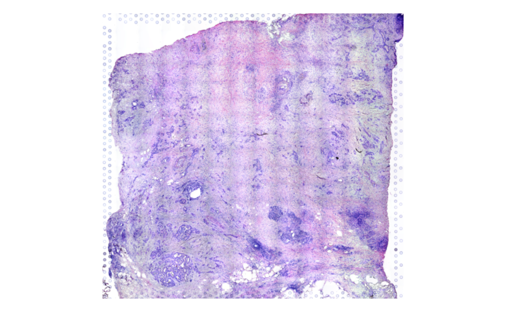
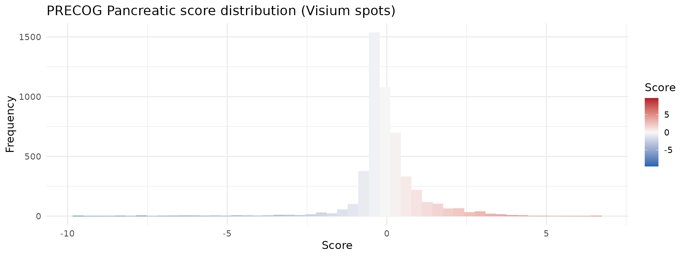
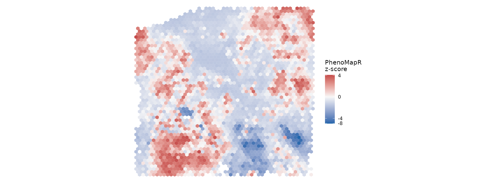
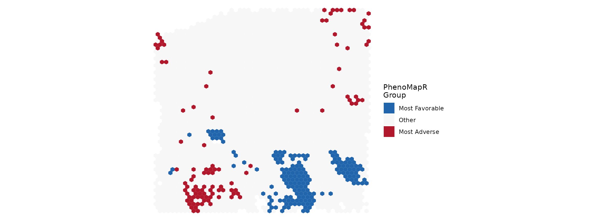
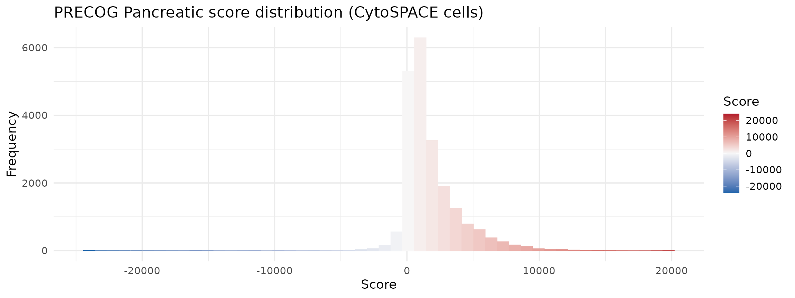
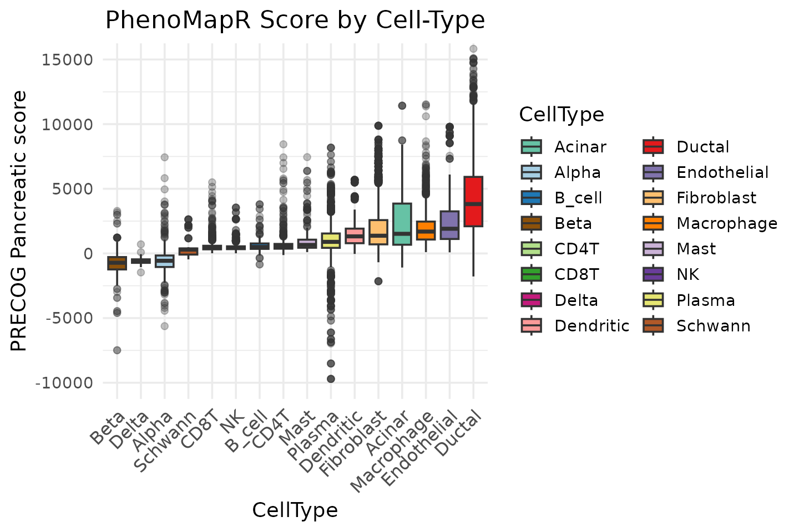
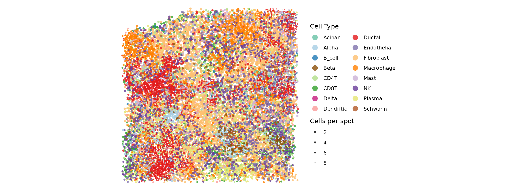
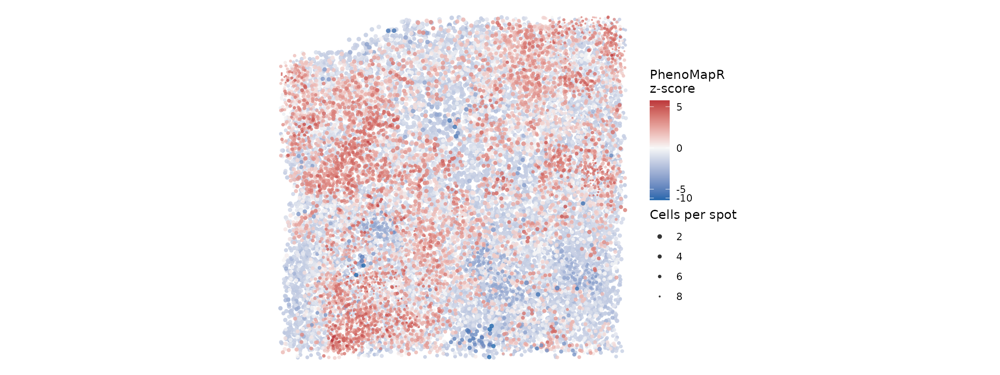
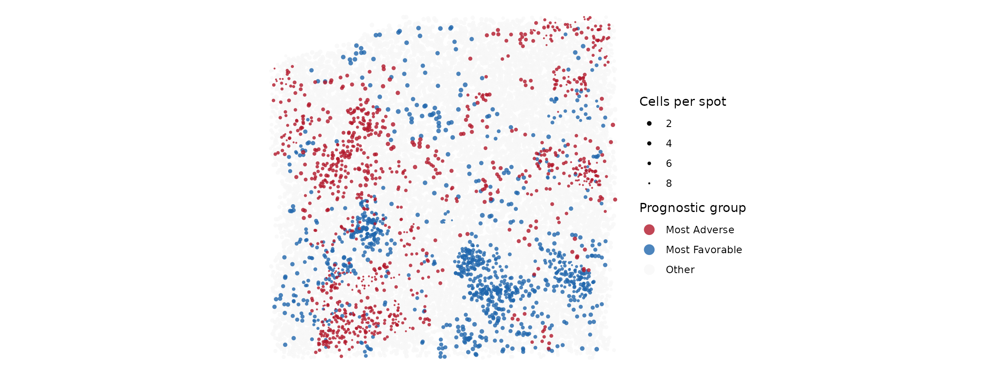

# Scoring spatial transcriptomics data with PhenoMapR

### Overview

This vignette demonstrates **{PhenoMapR}** on spatial transcriptomics in
two parts. **Part 1** uses **spot-level** 10X Visium data
(`HT270P1-S1H2Fc2U1Z1Bs1-H2Bs2-Test.hgnc.rds`): we show the **H&E** with
`SpatialPlot`, then score with PRECOG **Pancreatic** and map
**z-scaled** scores with **`stat_summary_hex`** (same coordinates and
aspect as H&E; no jitter). **Part 2** uses the same sample after
[**CytoSPACE**](https://www.nature.com/articles/s41587-023-01697-9)
mapped single cells onto spots
(`HT270P1-S1H2Fc2U1Z1Bs1-H2Bs2-Test_processed.rds`); we then mirror the
single-cell workflow (score by cell type, markers, heatmaps) at **cell**
resolution and assess **co-localization** of prognostic groups with
**[`spatialCooccur`](https://github.com/juninamo/spatialCooccur)**
(**`nhood_enrichment()`**, **`cooccur_local()`**).

The sample is from a pancreatic cancer dataset available from
[HTAN](https://humantumoratlas.org/).

### Download data and vizualize H&E histology

``` r
suppressPackageStartupMessages({
  library(PhenoMapR)
  library(Seurat)
  library(SeuratObject)
  library(ggplot2)
  library(dplyr)
})

knitr::opts_chunk$set(fig.width = 12, out.width = "100%", warning = FALSE)
theme_set(theme_minimal(base_size = 14))

options(googledrive_quiet = TRUE)
googledrive::drive_deauth()

gd_id_spot <- "1OkIr7ksAWxKVjtdlGqYHMidvHZZsySEE"
rds_spot <- "HT270P1-S1H2Fc2U1Z1Bs1-H2Bs2-Test.hgnc.rds"

googledrive::drive_download(googledrive::as_id(gd_id_spot), rds_spot, overwrite = TRUE)

seurat_spot <- readRDS("HT270P1-S1H2Fc2U1Z1Bs1-H2Bs2-Test.hgnc.rds")

SpatialPlot(object = seurat_spot,
  features = NULL,
  image.alpha = 1,
  pt.size.factor = 0) +
  guides(fill = "none") 
```



### Score spots with PhenoMapR

``` r
# Score spots
scores_spot <- PhenoMapR::PhenoMap(
    expression = seurat_spot,
    reference = "precog",
    cancer_type = "Pancreatic",
    assay = "Spatial",
    slot = "data",
    verbose = FALSE
  )

# Add scores to Seurat object
seurat_spot <- PhenoMapR::add_scores_to_seurat(seurat_spot, scores_spot)

score_col_spot <- grep("weighted_sum_score", names(scores_spot), value = TRUE)[1]
## Z-scaled PhenoMapR score on spots (for hex / metadata plots)
sc_sp <- suppressWarnings(as.numeric(seurat_spot@meta.data[[score_col_spot]]))
seurat_spot$phenomapr_scaled_spot <- as.numeric(scale(sc_sp))

plot_score_distribution(
  seurat_spot$phenomapr_scaled_spot,
  main = "PRECOG Pancreatic score distribution (Visium spots)",
  base_size = 14
)
```



### PhenoMapR score distribution across spots

``` r
p <- SpatialPlot(
  object = seurat_spot,
  features = "weighted_sum_score_Pancreatic", image.alpha = 0
)
cols_pheno <- grDevices::colorRampPalette(c("#2166AC", "#F7F7F7", "#B2182B"))(100)

df <- p$data  # extract data from SpatialPlot

spot_hex_bins <- max(10, min(50L, as.integer(round(sqrt(nrow(df))))))

ggplot(df, aes(
  x = x,
  y = -y,
  z = scale(weighted_sum_score_Pancreatic)
)) +
  stat_summary_hex(fun = mean, bins = spot_hex_bins) +
  scale_fill_gradient2(
    low = "#2166AC",
    mid = "#F7F7F7",
    high = "#B2182B",
    midpoint = 0,
    trans = scales::pseudo_log_trans(sigma = 0.2),
    # limits = c(-4, 4),
    name = "PhenoMapR\nz-score"
  )+
  coord_fixed() +
  theme_void()
```



``` r
df <- SpatialPlot(
  object = seurat_spot,
  features = "weighted_sum_score_Pancreatic", image.alpha = 0
)$data %>%
  as.data.frame()

groups_spot <- PhenoMapR::define_phenotype_groups(df, score_columns = "weighted_sum_score_Pancreatic", percentile = 0.05)

df <- left_join(df, groups_spot, by = c("cell" = "cell_id"))

# Helper function for mode
mode_val <- function(z) {
  z <- z[is.finite(z)]
  if (!length(z)) return(NA_real_)
  as.numeric(names(sort(table(z), decreasing = TRUE)[1L]))
}

ggplot(df, aes(
  x = x,
  y = -y,
  z = as.numeric(factor(
    phenotype_group_weighted_sum_score_Pancreatic,
    levels = c("Most Favorable", "Other", "Most Adverse")
  ))
)) +
  stat_summary_hex(
    aes(
      fill = after_stat(factor(
        value,
        levels = 1:3,
        labels = c("Most Favorable", "Other", "Most Adverse")
      ))
    ),
    bins = 50,
    fun = mode_val,
    colour = NA
  ) +
  scale_fill_manual(
    values = c(
      "Most Favorable" = "#2166AC",
      "Other"            = "#F7F7F7",
      "Most Adverse"     = "#B2182B"
    ),
    drop = FALSE,
    name = "PhenoMapR\nGroup"
  ) +
  coord_fixed() +
  theme_void()
```


Here, we can see that the most favorable spots seem to cluster together,
while a subset of the most adverse also tend to co-localize.

## Part 2: CytoSPACE-mapped cells

Load the **CytoSPACE** object (single cells placed on Visium
coordinates).

``` r
rds_cyto <- "HT270P1-S1H2Fc2U1Z1Bs1-H2Bs2-Test_processed.rds"
gd_id_cyto <- "1gcOyLriW9bIFNbDuQN6Vi1UsrMGKDxll"

googledrive::drive_download(googledrive::as_id(gd_id_cyto), rds_cyto, overwrite = TRUE)

seurat <- readRDS(rds_cyto)
```

### Score sample with PhenoMapR (CytoSPACE)

``` r
  scores_spatial <- PhenoMapR::PhenoMap(
    expression = seurat,
    reference = "precog",
    cancer_type = "Pancreatic",
    assay = "Spatial",
    slot = "data",
    verbose = FALSE
  )
  seurat <- PhenoMapR::add_scores_to_seurat(seurat, scores_spatial)
score_col <- grep("weighted_sum_score", names(scores_spatial), value = TRUE)[1]

plot_score_distribution(
  seurat@meta.data[[score_col]],
  main = "PRECOG Pancreatic score distribution (CytoSPACE cells)",
  base_size = 14
)
```



### Score by cell type

Before looking at any spatial information, we plot the **PhenoMapR**
score by cell type to see cell types most enriched in the adverse and
favorable prognostic groups.

``` r
spatial_celltype_pal <- NULL
spatial_celltype_col <- NULL
meta_names <- names(seurat@meta.data)
celltype_col <- "CellType"

df <- seurat@meta.data
n_meta <- nrow(df)
ann_vec <- NULL
if (!is.null(celltype_col)) {
  raw <- df[[celltype_col]]
  if (is.list(raw)) {
    ann_vec <- vapply(raw, function(x) if (is.null(x) || length(x) == 0) NA_character_ else as.character(x)[1], character(1))
  } else {
    ann_vec <- as.vector(raw)
  }
  if (length(ann_vec) != n_meta) ann_vec <- NULL
}

  df$annotation <- factor(ann_vec, exclude = NULL)

  pal <- PhenoMapR::get_celltype_palette(levels(df$annotation))
print(ggplot(df, aes(
    x = reorder(.data$annotation, .data[[score_col]], FUN = median),
    y = .data[[score_col]],
    fill = .data$annotation
  )) +
    geom_boxplot(outlier.alpha = 0.3) +
    scale_fill_manual(values = pal, name = celltype_col) +
    coord_cartesian(ylim = c(-10000, 15000)) +
    guides(fill = guide_legend(ncol = 2)) +
    theme_minimal(base_size = 14) +
    theme(
      axis.text.x = element_text(angle = 45, hjust = 1, size = 12),
      legend.position = "right",
      plot.title = element_text(hjust = 0.5)
    ) +
    labs(y = "PRECOG Pancreatic score", x = celltype_col, title = "PhenoMapR Score by Cell-Type"))
```


As seen in the other pancreatic cancer vignettes, the ductal cell type
is the most associated with the adverse prognostic signal, while the
beta and delta cells are most associated with favorable signal.
Interestingly, plasma cells show quite a wide range of score and contain
some of the most favorably prognostic cells across the sample.

### Where are the different cell types?

Here, we use the coordinates information from the spatial seurat object
and pair them with the cell level metadata in order to plot the results
in spatial context.

``` r
cell_locations <- seurat@meta.data %>%
  as.data.frame() %>%
  dplyr::select("Cell", "row", "col", 
                "CellType", "weighted_sum_score_Pancreatic") %>%
    group_by(.data$row, .data$col) %>%
    mutate(points_per_location = n()) %>%
    ungroup()

cell_locations$CellType <- as.factor(cell_locations$CellType)

  # Shared jitter and point size so all three spatial plots match (multiple cells per spot)
  rng_row <- diff(range(cell_locations$row, na.rm = TRUE))
  rng_col <- diff(range(-cell_locations$col, na.rm = TRUE))
  spatial_jitter_w <- max(0.25, if (rng_row > 0) rng_row * 0.025 else 0.15)
  spatial_jitter_h <- max(0.25, if (rng_col > 0) rng_col * 0.025 else 0.15)
  spatial_point_range <- c(0.5, 1.6)

  spatial_celltype_pal <- PhenoMapR::get_celltype_palette(levels(cell_locations$CellType))
  
    ct_freq <- sort(table(cell_locations$CellType, useNA = "no"), decreasing = TRUE)
  ct_order <- names(ct_freq)
  cell_locations$celltype_zorder <- as.numeric(factor(as.character(cell_locations$CellType), levels = ct_order))
  ct_pal <- if (!is.null(spatial_celltype_pal)) spatial_celltype_pal else PhenoMapR::get_celltype_palette(levels(cell_locations$CellType))
 
   ggplot(cell_locations, aes(x = .data$row, y = -.data$col, color = .data$CellType,
    size = points_per_location, zorder = .data$celltype_zorder)) +
    geom_jitter(alpha = 0.8, width = spatial_jitter_w, height = spatial_jitter_h, shape = 16) +
    scale_color_manual(values = ct_pal, name = "Cell Type", na.value = "grey90") +
    scale_size_continuous(range = spatial_point_range, trans = "reverse", name = "Cells per spot") +
    guides(
      color = guide_legend(override.aes = list(size = 4), ncol = 2)
      # size  = guide_legend(override.aes = list(size = 4))
    ) +
    theme_minimal(base_size = 14) +
    theme(
      plot.title  = element_blank(),
      axis.text   = element_blank(),
      axis.ticks  = element_blank(),
      axis.title  = element_blank()
    ) +
       coord_fixed(ratio = 0.6) +
  theme_void()
```



#### Where raw PhenoMapR scores are

Spatial map of PhenoMapR score (z-scaled for color gradient). Blue =
more favorable, red = more adverse.

``` r
cell_locations <- cell_locations[order(abs(cell_locations$weighted_sum_score_Pancreatic)), ]

ggplot(cell_locations, aes(
  x = .data$row,
  y = -.data$col,
  color = scale(weighted_sum_score_Pancreatic),
  size = .data$points_per_location
)) +
  geom_jitter(alpha = 0.8, width = spatial_jitter_w, height = spatial_jitter_h, shape = 16) +
  scale_size_continuous(range = spatial_point_range, trans = "reverse", name = "Cells per spot") +
  scale_color_gradient2(
    low = "#2166AC", mid = "#F7F7F7", high = "#B2182B",
    midpoint = 0,
    trans = scales::pseudo_log_trans(sigma = 0.2),
    name = "PhenoMapR\nz-score"
  ) +
  coord_fixed(ratio = 0.6) +
  theme_void()
```



#### Where 5th percentile cells are

In order to make the visualization more apparent, we restrict the
spatial map of prognostic groups to: top 5% (Most Adverse), bottom 5%
(Most Favorable), and the rest (Other).

``` r
cell_locations <- cell_locations %>% 
  mutate(percentile = percent_rank(weighted_sum_score_Pancreatic)) %>%
  mutate(prognostic_group = case_when(
    percentile < 0.05 ~ "Most Favorable",
    percentile >= 0.95 ~ "Most Adverse",
    TRUE ~ "Other"
  ))

  df_other <- cell_locations %>%
    dplyr::filter(prognostic_group=="Other")
  
  df_extreme <- cell_locations %>%
    dplyr::filter(prognostic_group!="Other")
  
  ggplot() +
    geom_jitter(data = df_other, aes(x = .data$row, y = -.data$col, color = .data$prognostic_group,
      size = points_per_location), alpha = 0.8, width = spatial_jitter_w, height = spatial_jitter_h, shape = 16) +
    geom_jitter(data = df_extreme, aes(x = .data$row, y = -.data$col, color = .data$prognostic_group,
      size = points_per_location), alpha = 0.8, width = spatial_jitter_w, height = spatial_jitter_h, shape = 16) +
    # ggtitle("5th percentile: Most Adverse vs Most Favorable") +
    scale_color_manual(
      values = c(`Most Adverse` = "#B2182B", Other = "#f7f7f7", `Most Favorable` = "#2166AC"),
      name = "Prognostic group",
      na.value = "grey90",
      drop = FALSE
    ) +
     guides(
      color = guide_legend(override.aes = list(size = 4))
      # size  = guide_legend(override.aes = list(size = 4))
    ) +
    scale_size_continuous(range = spatial_point_range, trans = "reverse", name = "Cells per spot") +
    theme_minimal(base_size = 14) +
    theme(
      plot.title = element_text(hjust = 0.5, size = 14),
      axis.text = element_blank(),
      axis.ticks = element_blank(),
      axis.title = element_blank()
    ) +
  coord_fixed(ratio = 0.6) +
  theme_void()
```


